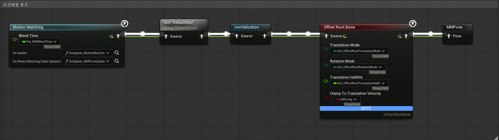
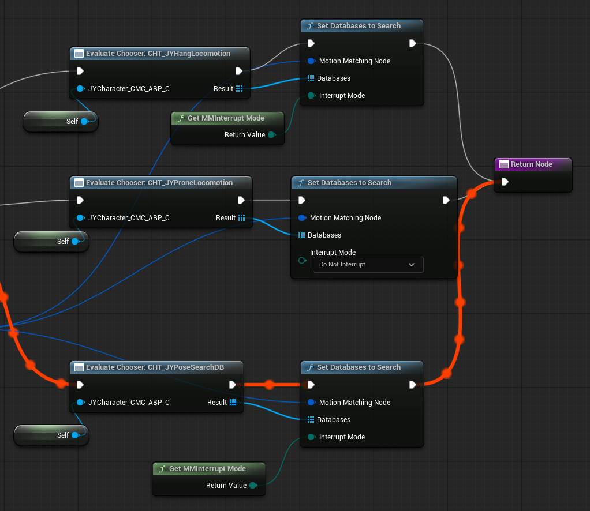
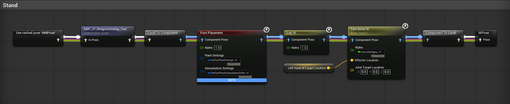
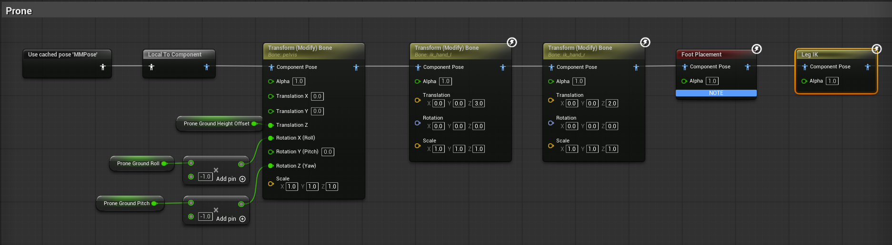
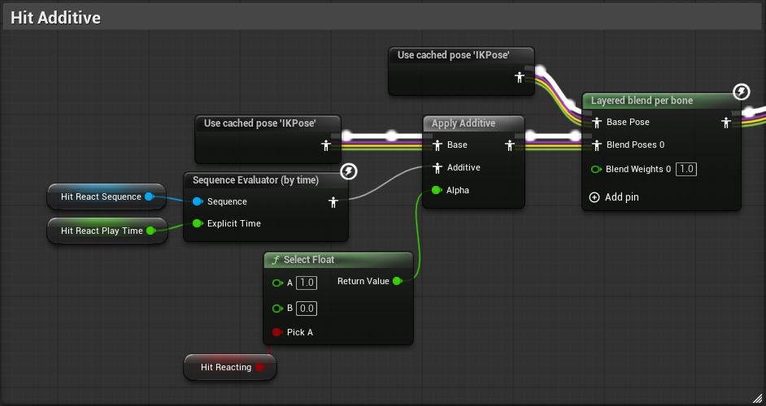
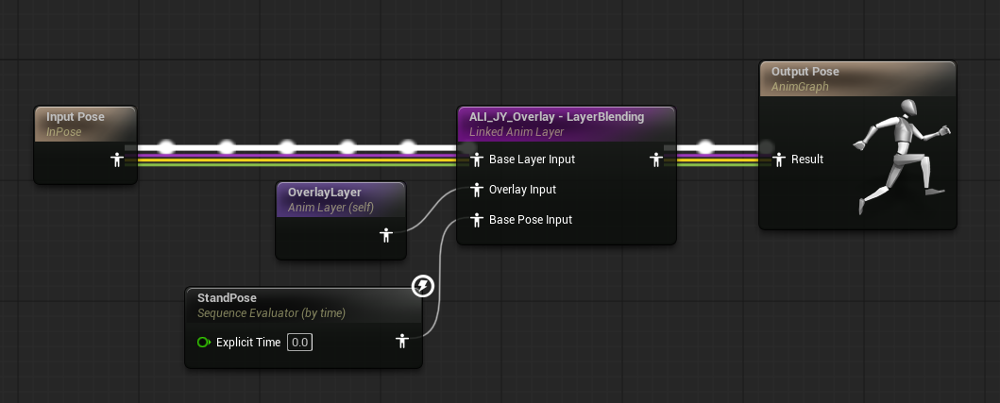
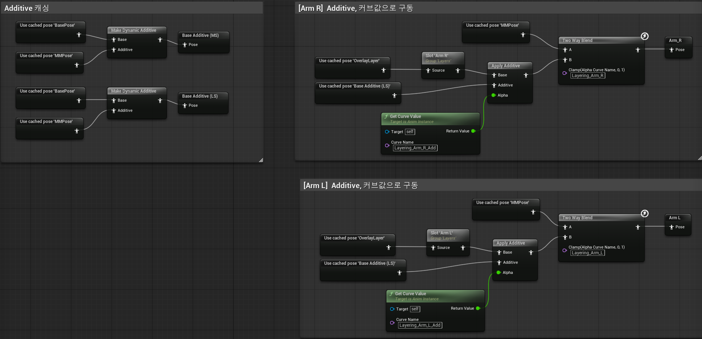
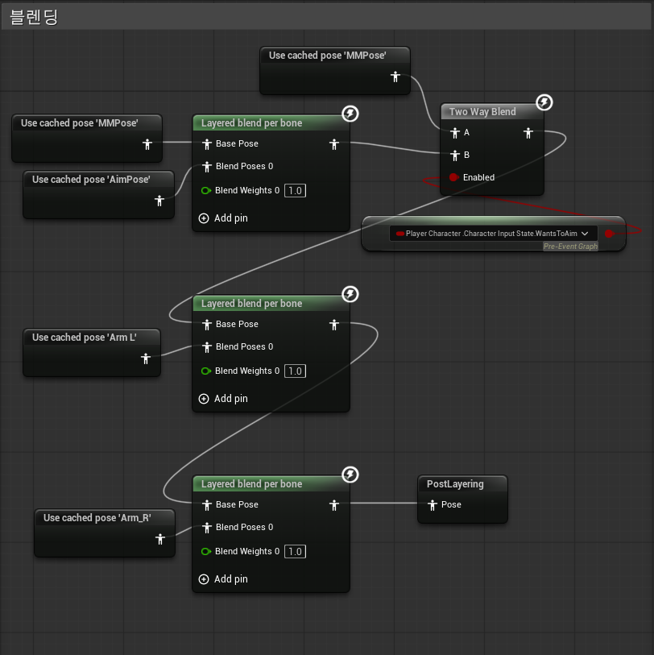

## Project Description

UE 5.7 기반의 멀티플레이어 슈터 포트폴리오 프로젝트입니다.

모션 매칭을 적용하고, 캐릭터 이동 확장(매달리기, 기어가기), 총기 시스템을 구현했습니다.

 

## Reference Projects

- Game Animation Sample Project (GASP)
- Lyra Starter Game

 

## Main Features

### 1. Motion Matching & Parkour

- GASP 구조를 참고한 Motion Matching 기반 이동 시스템 적용
- 파쿠르 액션 구조 분석 및 프로젝트에 맞게 연동

### 2. Ledge Hang & Movement

- 난간 감지 및 매달리기 처리
- 난간 상태에서의 좌우 이동 구현

### 3. Prone System

- 기어가기 상태 구현 (경사면 포함)

### 4. Weapon System

- 총기 IK 구성
- Gameplay Ability System(GAS) 기반 무기 발사 구현
- Hitscan / 탄도학 기반 사격 구현
- 재질별 관통 판정
- 벽 근접 시 총기 올림
- 무기 슬롯별 Attach / Detach
- Recoil 기반 반동
- Tracer / Muzzle Flash / Shell Eject / Material-based Impact / Camera Shake 사격 연출
- Data Asset 기반 무기 데이터 관리

 

## Main Anim Graph

### Motion Matching

### Chooser Table 

### Stand

### Prone

### Hit

 

## Overlay Graph

### Overlay_MainAnimGraph

### Overlay Additive

### Overlay Blending

